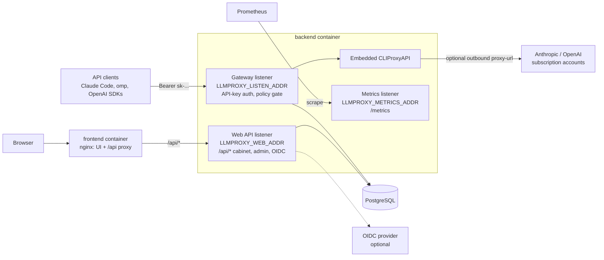

# llm-proxy

[](https://hub.docker.com/r/yoonaowo/llm-proxy-backend) [](https://hub.docker.com/r/yoonaowo/llm-proxy-frontend) [](https://github.com/elleqt/llm-proxy-backend/actions/workflows/ci.yml)

A self-hosted gateway that lets a team share Claude (Pro/Max) and ChatGPT (Plus/Pro) subscriptions through personal API keys. It embeds [CLIProxyAPI](https://github.com/router-for-me/CLIProxyAPI) as a Go library and adds what a shared deployment needs: users and sign-in (local accounts or any OIDC provider), self-service API keys, per-user model access rules, a web admin panel, a usage ledger with estimated cost, and Prometheus metrics.

> **llm-proxy is one system in two repositories:** [llm-proxy-backend](https://github.com/elleqt/llm-proxy-backend) — the gateway, web API and metrics (start here to run it) · [llm-proxy-frontend](https://github.com/elleqt/llm-proxy-frontend) — the web interface: cabinet and admin panel.

## Contents

- [What it is / why](#what-it-is--why)
- [Screenshots](#screenshots)
- [How it works](#how-it-works)
- [Quick start](#quick-start)
- [First sign-in](#first-sign-in)
- [Upgrading](#upgrading)
- [Images](#images)
- [Building from source](#building-from-source)
- [Connecting clients](#connecting-clients)
- [Access control](#access-control)
- [Sign-in with an identity provider (OIDC)](#sign-in-with-an-identity-provider-oidc)
- [Production deployment](#production-deployment)
- [Administration](#administration)
- [Metrics and cost](#metrics-and-cost)
- [Configuration reference](#configuration-reference)
- [Security notes](#security-notes)
- [Development](#development)
- [Related repository](#related-repository)
- [License](#license)

## What it is / why

A plain CLIProxyAPI setup keeps API keys and access in one config file. Everything depends on the one person who can edit that file and restart the service. llm-proxy moves that work into a web interface, where users and admins do it themselves.

| Pain with a single config file | What llm-proxy does |
|---|---|
| A key leaks or a laptop is lost; you message the admin and wait | The user revokes the key in the cabinet. It stops working on the next request |
| A new device or tool needs a key; the admin edits the config and restarts | The user issues their own key. No config edit, no restart |
| Everyone can use every model | Access is set per person and per model (e.g. only ChatGPT, or only Sonnet), in the admin panel or from identity-provider groups. Changes apply to existing keys at once |
| Onboarding and offboarding are manual | Access follows your identity provider: join the group to get in. Blocking an account cuts all its keys and sessions at once |
| One shared key; nobody knows who used what | Each key belongs to a person or a service account. Usage, cost and quota use are visible per user: users see their own spend and cache savings, admins see everyone's, Prometheus gets the rest |
| Vendor tokens are copied onto the server by hand | Vendor accounts are added through a browser sign-in wizard |
| Cost estimates need a price list someone maintains | Prices update themselves from a public model catalog; manual overrides win |
| Nobody knows who changed what | Admin actions are written to an audit log |

Clients: Claude Code, [omp](https://github.com/can1357/oh-my-pi), any OpenAI-compatible client, and Codex-style clients (`/backend-api/codex/responses`).

## Screenshots

| | |
|---|---|
| <br>Sign-in: local password and/or identity provider | <br>Cabinet: your keys, usage and estimated cost |
| <br>Connect: client setup with your key filled in | <br>Admin: users and service accounts |
| <br>Admin: one user's access rules, keys and activity | <br>Admin: vendor accounts and quota |
| <br>Admin: gateway settings and prices | <br>Cabinet in the dark theme, Russian UI |

## How it works



The backend is one process with three listeners.

**Gateway listener** (`LLMPROXY_LISTEN_ADDR`, default `:8080`). The proxied LLM API: `/v1/models`, `/v1/chat/completions`, `/v1/responses`, `/v1/messages`, `/backend-api/codex/responses` and a few more. Every request needs an llm-proxy API key. A policy gate checks the requested model against the key owner's access rules before the request reaches CLIProxyAPI. Routes the gate cannot decide on (websocket relays, realtime sessions and so on) are refused. `GET /healthz` is the only route open without a key. This is the one listener you publish, and only through a reverse proxy: its HTTP server has no header or idle timeouts (see [Production deployment](#production-deployment)).

**Web API listener** (`LLMPROXY_WEB_ADDR`, default `127.0.0.1:8081`). Serves `/api/*` for the cabinet, the admin panel and sign-in (sessions, OIDC). Only the frontend's nginx should reach it: it trusts `X-Real-IP` for rate limiting and audit. **Never expose it directly.** Set it to `off` to run the gateway without a web interface.

**Metrics listener** (`LLMPROXY_METRICS_ADDR`, default `127.0.0.1:9090`). Serves `/metrics` for Prometheus, with no authentication. **Never expose it.** Only a scraper inside your network should reach it.

In both compose files only the gateway (host port `8080`) and the frontend (host port `8081`) are published. In the full `docker-compose.yml` the web API listens only on the `web` network, and metrics only on the `metrics` network; the minimal file puts all three containers on one network and leaves metrics on the backend's loopback.

## Quick start

Ready-made images for `linux/amd64` and `linux/arm64` are published on Docker Hub; nothing is built on your machine. You need Docker with the Compose v2 plugin, and openssl for the database password and the credentials key.

### 1. Install Docker

- **Linux:** use Docker's convenience script or your distribution's instructions ([docs.docker.com/engine/install](https://docs.docker.com/engine/install/)):

  ```sh
  curl -fsSL https://get.docker.com | sh
  sudo usermod -aG docker "$USER"   # then log out and back in
  ```

- **macOS / Windows:** install [Docker Desktop](https://docs.docker.com/desktop/).

Check both:

```sh
docker --version
docker compose version   # must work: the Compose v2 plugin is required
```

### 2. Make a directory for the stack

```sh
mkdir llm-proxy && cd llm-proxy
```

### 3. Create `docker-compose.yml`

There are two versions of the compose file. Both run the same images and start the same stack; pick one.

**Minimal** (the shortest path): only what the stack needs to start and to let you sign in over plain http. Download it as `docker-compose.yml`:

```sh
curl -fsSL -o docker-compose.yml https://raw.githubusercontent.com/elleqt/llm-proxy-backend/main/docker-compose.minimal.yml
```

or save this as `docker-compose.yml` (it is the same file):

<!-- readme-sync: docker-compose.minimal.yml -->
```yaml
# llm-proxy, minimal version: only what the stack needs to start and to sign in
# over plain http. docker-compose.yml has every setting, with comments.
services:
  postgres:
    image: postgres:17-alpine
    environment:
      POSTGRES_USER: llmproxy
      # CHANGE ME: the same value as PGPASSWORD below. Postgres takes it only on its
      # first start, with an empty volume.
      POSTGRES_PASSWORD: change-me-db-password
    volumes:
      - pgdata:/var/lib/postgresql/data
    healthcheck:
      test: ["CMD", "pg_isready", "-U", "llmproxy"]
      interval: 5s
      timeout: 3s
      retries: 10

  backend:
    # Keep one version for both images.
    image: yoonaowo/llm-proxy-backend:0.2.0
    environment:
      LLMPROXY_DATABASE_URL: postgres://llmproxy@postgres:5432/llmproxy?sslmode=disable
      # CHANGE ME: the same value as POSTGRES_PASSWORD above.
      PGPASSWORD: change-me-db-password
      # CHANGE ME (openssl rand -hex 32), best before adding vendor accounts: the
      # placeholder works but is public, and the backend warns while it is set. The key
      # encrypts the vendor accounts in the database; changing or losing it means
      # signing them in again.
      LLMPROXY_CREDENTIALS_KEY: change-me-credentials-key-at-least-32-bytes
      LLMPROXY_WEB_ADDR: ":8081"
      LLMPROXY_PUBLIC_API_URL: http://localhost:8080
      LLMPROXY_COOKIE_SECURE: "false"
      LLMPROXY_BOOTSTRAP_ADMIN_EMAIL: admin@example.com
    volumes:
      # COMPAT(credentials-import): an earlier release's vendor account files,
      # imported into the database once; the next release removes this mount.
      - grants:/var/lib/llmproxy/auths
    ports:
      - "8080:8080"
    depends_on:
      postgres:
        condition: service_healthy

  frontend:
    image: yoonaowo/llm-proxy-frontend:0.2.0
    ports:
      - "8081:8080"

volumes:
  pgdata:
  # COMPAT(credentials-import): removed with the mount above in the next release.
  grants:
```

**Full**: [`docker-compose.yml`](docker-compose.yml) in this repository. Use it for a production deployment: it keeps the web API and the metrics on their own Docker networks, exposes `/metrics` to a scraper, and writes every setting out with a comment, defaults as values and optional settings (OIDC and others) as commented-out examples. Download it instead of the minimal file:

```sh
curl -fsSLO https://raw.githubusercontent.com/elleqt/llm-proxy-backend/main/docker-compose.yml
```

No `.env` file is needed with either: every value is in the compose file, and you change a setting by editing it there. `CHANGE ME` marks what to change; either file also starts unchanged (see step 4). Both files use the same volume, user and database names, so you can switch from the minimal file to the full one later and keep your data: put the database password and the credentials key you already use into the new file instead of new ones.

### 4. Set the database password and the credentials key

The compose file starts as downloaded, which is enough to try the stack on your own machine. Its placeholders are public, though, so for anything else replace `change-me-db-password` (it appears twice: Postgres and the backend) and `change-me-credentials-key-at-least-32-bytes` with random values:

```sh
sed -i -e "s/change-me-db-password/$(openssl rand -hex 24)/g" \
  -e "s/change-me-credentials-key-at-least-32-bytes/$(openssl rand -hex 32)/" docker-compose.yml
```

On macOS:

```sh
sed -i '' -e "s/change-me-db-password/$(openssl rand -hex 24)/g" \
  -e "s/change-me-credentials-key-at-least-32-bytes/$(openssl rand -hex 32)/" docker-compose.yml
```

Best do this before the first start: Postgres sets the password only when it creates the database in an empty volume, so changing it later in the file alone leaves the database on the old one, and the backend can no longer connect. The credentials key encrypts the vendor accounts stored in the database, so replace it at the latest before adding the first vendor account: accounts added under one key must be signed in again after a change. With the placeholder anyone who gets a copy of the database can read them, and the backend logs a warning on every start while it is set. Keep a copy of your key with your other secrets, apart from database backups. Without it the accounts cannot be read and must be signed in again (see [Backups](#production-deployment)).

**Already started with the placeholders?** If there is nothing to keep, `docker compose down -v` deletes the stack and its data: replace the placeholders as above and start again. To keep the data, change the database password in Postgres first, then in the file, and restart (on macOS `sed -i ''`):

```sh
db_password="$(openssl rand -hex 24)"
docker compose exec postgres psql -U llmproxy -c "ALTER USER llmproxy PASSWORD '$db_password'"
sed -i -e "s/change-me-db-password/$db_password/g" \
  -e "s/change-me-credentials-key-at-least-32-bytes/$(openssl rand -hex 32)/" docker-compose.yml
docker compose up -d
```

Vendor accounts added under the placeholder key cannot be read under the new one: the backend stops at start and names the account. Delete them and sign them in again, as under *Lost or changed key* in [Backups](#production-deployment).

### 5. Start

```sh
docker compose up -d
```

Compose pulls the images and starts Postgres, the backend and the frontend. Database migrations run when the backend starts. `docker compose ps` shows all three as `healthy` once they are up (with the minimal file, which gives the backend no healthcheck, the backend as `Up`).

### 6. Sign in as the bootstrap administrator

On its first start the backend creates the administrator and prints a one-time temporary password (details and recovery: [First sign-in](#first-sign-in)):

```sh
docker compose logs backend | grep -A1 'account:'
```

Open **http://localhost:8081**, sign in with that email and password, and choose a new password. Then give yourself model access: your administrator starts with **no model access**. Open **Admin → Users**, select your account and add a rule such as `claude:*` or `chatgpt:*` (see [Access control](#access-control)).

### 7. Add a vendor account


1. Go to **Admin → Providers → Add account** and choose `claude` or `chatgpt`.
2. Open the sign-in link and sign in to the vendor with the subscription account you want to share.
3. At the end, the browser goes to a `localhost` URL that **does not load**. This is expected. The vendor's OAuth client is registered for CLI tools, which run a small listener on your own machine to catch that redirect. llm-proxy runs on a server and opens no such listener. The authorization code is in the URL itself.
4. Copy the **whole URL** from the address bar, paste it into the wizard, and click **Finish adding**.

The link is valid for 5 minutes. If the pasted URL is wrong, the sign-in stays open and you can paste again. The vendor account's OAuth credentials are stored in Postgres, encrypted with `LLMPROXY_CREDENTIALS_KEY`.

### 8. Issue a key and test it

In the **Cabinet**, click **Issue a key**, give it a label, and copy the key. It is shown only once.

```sh
curl http://localhost:8080/v1/models \
  -H "Authorization: Bearer sk-..."
```

The list contains only the models your rules allow. An empty list usually means no vendor account is added yet or your policy has no rules.

## First sign-in

### The bootstrap administrator

- **When it is created.** At every start the backend checks whether any administrator exists (blocked ones count). Only while none does, it creates a local administrator with the email in `LLMPROXY_BOOTSTRAP_ADMIN_EMAIL` (default `admin@example.com`; set it empty to turn this off). Once an administrator exists, the variable does nothing: changing it later creates no second administrator.
- **If the email already belongs to an account** that is not an administrator, the backend refuses to start with an error rather than promote it.
- **The temporary password** is printed once, to the backend's output, never through the logger:

  ```text
  =================== llm-proxy: bootstrap administrator ===================
    account:            admin@example.com
    temporary password: <random password>
    Shown this once. Sign in on the web interface and choose a new password.
  ===========================================================================
  ```

  ```sh
  docker compose logs backend | grep -A1 'account:'
  ```

  It is stored only as a hash and stays in the container log until the container is recreated (for example by `docker compose up -d` after an upgrade). The bootstrap password does **not** expire; every temporary password an administrator issues later (new users, resets) expires after **72 hours**. An expired temporary password no longer signs in.
- **Forced password change.** A session opened with a temporary password can do nothing but change the password. After the change the account works normally.
- **Model access.** Every new administrator starts with an empty policy: add a rule for yourself in **Admin → Users** before issuing keys.
- If `LLMPROXY_LOCAL_LOGIN=false`, the bootstrap administrator cannot sign in with the password; the backend warns about it at start. Keep local sign-in on until another way in works.

### Lost access

While the stack is running, the backend's command line issues a new temporary password for any local account (people, not service accounts):

```sh
docker compose exec backend gateway reset-password admin@example.com
```

It prints the new temporary password once, valid for 72 hours:

```text
======================= llm-proxy: password reset ========================
  account:            admin@example.com
  temporary password: <random password>
  expires:            2026-09-26T09:15:56Z
  Shown this once. Sign in on the web interface and choose a new password.
===========================================================================
```

The account must change the password at the next sign-in, is signed out everywhere and its sign-in lockout is cleared; its API keys keep working. The reset is recorded in the audit log. The command refuses (exit code `1`, reason on stderr) an unknown email, a service account and a blocked account. `gateway reset-password --unblock <email>` also unblocks the account, but only when it is an administrator and no other administrator is active (the only administrator was blocked); any other blocked account is unblocked by an administrator in the web interface. With local sign-in off (`LLMPROXY_LOCAL_LOGIN=false`, or the web listener off), the command still prints the password but warns on stderr that it cannot be used until local sign-in is turned on.

Use it when:

- the bootstrap password scrolled out of the log or the container was recreated before the first sign-in;
- a temporary password expired;
- the only administrator forgot their password.

With a second administrator, **Admin → Users → reset password** does the same from the web interface. Keeping two administrators is the simplest insurance.

### More administrators

- **Promote an existing person:** **Admin → Users**, open the user and change the role to administrator. Nobody can demote or block themselves, so an installation always keeps the administrator doing the edit.
- **Create one:** **Admin → Users → create**, role administrator, with a local password (a 72-hour temporary password is shown once) or an identity-provider invitation.

### Administrators and the identity provider

An account is linked to an identity-provider login in one of two ways, never by a matching email alone:

- **Invitation.** A user created with an invitation, or any person whose user page shows **renew invitation** (also your own bootstrap administrator), gets an invitation for their email that lasts 72 hours. The first OIDC sign-in whose provider reports that email **as verified** claims it and links the login to the account for good, role included. The group check (`LLMPROXY_OIDC_REQUIRED_GROUP`) still applies.
- **Sign-up** (`LLMPROXY_OIDC_ALLOW_SIGNUP=true`) creates a new, non-administrator account; promote it afterwards. A sign-up whose email already belongs to another account is refused.

With `LLMPROXY_OIDC_GROUP_POLICY` set, a linked account's model rules come from its groups at every sign-in, administrators included. The role never comes from the identity provider.

## Upgrading

1. **Back up Postgres first** (see [Backups](#production-deployment)): migrations run automatically when the backend starts and are not rolled back by going back to an older image.
2. In `docker-compose.yml`, change the tag of both images, `yoonaowo/llm-proxy-backend` and `yoonaowo/llm-proxy-frontend`, to the new release (they are released together, always use one version for both). The current release is on the [releases page](https://github.com/elleqt/llm-proxy-backend/releases) and the [Docker Hub tags page](https://hub.docker.com/r/yoonaowo/llm-proxy-backend/tags). With `X.Y.Z` the new version:

   ```sh
   sed -i -E 's#(yoonaowo/llm-proxy-(backend|frontend)):[^ ]+#\1:X.Y.Z#' docker-compose.yml
   ```

   (on macOS: `sed -i '' -E …`).

3. Pull and restart:

   ```sh
   docker compose pull && docker compose up -d
   ```

If a migration fails, the backend does not start; `docker compose logs backend` shows why. Release notes are on the [releases page](https://github.com/elleqt/llm-proxy-backend/releases). A newer compose file is not required for an upgrade unless the release notes say so. This release is one of those: it needs `LLMPROXY_CREDENTIALS_KEY` set, or the backend does not start (see [Vendor accounts move into the database](#vendor-accounts-move-into-the-database)). <!-- COMPAT(credentials-import): drop the "This release" sentence next release. -->

### Vendor accounts move into the database

<!-- COMPAT(credentials-import): this entry describes the one-shot import; the next release replaces it (RELEASING.md, "Next release: remove the credentials import"). -->
From this release the vendor accounts' OAuth credentials are stored in Postgres, encrypted, instead of as files in the `grants` volume, and CLIProxyAPI writes no request or error log files. Upgrading from an earlier release:

1. Add `LLMPROXY_CREDENTIALS_KEY` to the backend's `environment` (at least 32 bytes, e.g. `openssl rand -hex 32`) and store it with your other secrets. **The backend does not start without it.** Losing it means signing every vendor account in again.
2. Keep the `grants` volume mounted for this upgrade (the shipped compose files do). On the first start the accounts are imported into the database once; the files are not changed. If the backend stops at start naming a file in that volume, the file could not be read: fix or remove it and start again. If the first start ran without the volume, nothing was imported and the import does not run again by itself. Provided no vendor account has been added since, delete the import's marker and restart with the volume mounted, which imports the files (an account added since under the name of one of the files makes the import fail at start and roll back):

   ```sh
   docker compose exec postgres psql -U llmproxy llmproxy -c "DELETE FROM settings WHERE key = 'vendor_credentials_import';"
   docker compose up -d
   ```

3. If the log warns that `save-cooldown-status`, `request-log` or `error-logs-max-files` is ignored, remove it from the settings document in the admin panel (**Admin → Settings**).
4. The `runtime` volume is no longer used: remove the `runtime` mount and volume from your `docker-compose.yml` (the full file had them), run `docker compose up -d`, then `docker volume rm <project>_runtime`.

**Do not skip this release.** It is the only one that imports the account files; the next release removes the import and the `grants` volume (the list of what it removes is in [RELEASING.md](RELEASING.md#next-release-remove-the-credentials-import)). An installation on an earlier release must upgrade to this one and start it once (the log reports `imported the vendor credential files into the database` with the count) before upgrading further. Upgrading past it leaves the accounts unimported, and removing the `grants` volume then deletes their only copy.

**Going back to an earlier release** reads the account files in the `grants` volume, which this release leaves as they were at the upgrade: accounts added since then are missing, and accounts removed since then come back. Upgrading again does not import a second time (the import runs once), so accounts added or signed in again while on the earlier release are lost and must be signed in again.

## Images

| Image | Docker Hub |
|---|---|
| backend | [`yoonaowo/llm-proxy-backend`](https://hub.docker.com/r/yoonaowo/llm-proxy-backend) |
| frontend | [`yoonaowo/llm-proxy-frontend`](https://hub.docker.com/r/yoonaowo/llm-proxy-frontend) |

**Platforms:** every tag is one multi-arch manifest for `linux/amd64` and `linux/arm64`, so the same compose file runs on x86-64 servers and PCs, a Raspberry Pi 4 or 5 with a 64-bit OS, Apple Silicon Macs (Docker Desktop) and ARM servers. Docker picks the right one.

**Tags:**

| Tag | Meaning |
|---|---|
| `X.Y.Z` | One release, never moves. **Recommended**: the compose files name one |
| `X.Y` | The newest patch release of `X.Y` |
| `X` | The newest release of major version `X`; published from `1.0.0` on |
| `latest` | The newest release |
| `edge` | The current `main` branch: untested between releases, not for production |
| `sha-<commit>` | One `main` commit |

Images carry OCI labels (source, revision, version) and an SBOM and provenance attestation; the backend reports its version in the `llmproxy_build_info` metric.

## Building from source

For development, or to run unreleased changes: clone both repositories side by side (the build override builds the frontend from `../frontend`, so the directory names matter) and add `docker-compose.build.yml` to the compose command:

```sh
mkdir llm-proxy && cd llm-proxy
git clone https://github.com/elleqt/llm-proxy-backend.git backend
git clone https://github.com/elleqt/llm-proxy-frontend.git frontend
cd backend
docker compose -f docker-compose.yml -f docker-compose.build.yml up -d --build
```

The override works on top of `docker-compose.minimal.yml` too. It tags the images `llm-proxy-backend:local` and `llm-proxy-frontend:local`, so a source build never passes for a published image. Pass both `-f` files to every later command for this stack (`logs`, `down`, …), or `export COMPOSE_FILE=docker-compose.yml:docker-compose.build.yml` in your shell. Both placeholders work for a local build: Postgres is not published, and the backend only warns about the public credentials key (see [step 4](#4-set-the-database-password-and-the-credentials-key)). To update: `git pull` in both checkouts and run the same `up -d --build`.

## Connecting clients


The web UI's **Connect** page shows the same snippets with your key and your deployment's API URL filled in. Below, `https://llm-proxy.example.com` is `LLMPROXY_PUBLIC_API_URL`.

**Claude Code**: the base URL has no `/v1`.

```sh
export ANTHROPIC_BASE_URL="https://llm-proxy.example.com"
export ANTHROPIC_AUTH_TOKEN="sk-..."
claude
```

**omp**: override the base URL of the built-in `anthropic` and `openai-codex` providers in `~/.omp/agent/models.yml`. omp keeps its own model list and features; only the address and the key change. Keep only the provider(s) your rules allow:

```yaml
providers:
  anthropic:
    baseUrl: https://llm-proxy.example.com
    apiKey: "sk-..."
    api: anthropic-messages
    authHeader: true
    compat:
      supportsEagerToolInputStreaming: true
  openai-codex:
    baseUrl: https://llm-proxy.example.com/backend-api
    apiKey: "sk-..."
    authHeader: true
```

**OpenAI-compatible clients**: use `https://llm-proxy.example.com/v1` as the base URL and the key as the API key.

```sh
curl https://llm-proxy.example.com/v1/chat/completions \
  -H "Authorization: Bearer sk-..." \
  -H "Content-Type: application/json" \
  -d '{"model": "gpt-5", "messages": [{"role": "user", "content": "Hello"}]}'
```

The gateway accepts the key as `Authorization: Bearer`, `X-Api-Key` or `X-Goog-Api-Key`. A `401` means the key is wrong, revoked, or its owner is blocked. A `403` means the key works but your rules do not cover that model.

## Access control


Access belongs to the **user**, not to the key. A user's policy is a list of allow rules of the form `<provider>:<model-glob>`:

```text
chatgpt:*                    every ChatGPT model, including ones released later
claude:claude-sonnet-*       every Claude Sonnet model
claude:claude-opus-4-?       one character after "4-"
*:*                          everything
```

- **Providers** are `claude` and `chatgpt` (the Codex backend is called `chatgpt` in rules). Matching is case-insensitive.
- **Globs:** `*` matches any run of characters, including `/` and `:`. `?` matches exactly one character. Everything else is literal, and the pattern must match the whole model name. The rule splits on the first colon, so model names can contain colons.
- **Wildcards are evaluated per request** against the live model catalog. `chatgpt:*` covers a model the vendor releases tomorrow.
- **A model served by several providers** must be allowed on **all** of them. The router may choose any of them.
- **There are no deny rules.** Order does not matter. An empty policy allows nothing.
- **`/v1/models` shows only allowed models.** The cabinet shows the same list.
- **Edits apply at once** to every existing key of the user, from the next request. Nothing is cached.

The admin panel has a preview that shows which current models a rule set covers.

### Local and identity-provider accounts

- **Local accounts:** an administrator creates the user, and the system shows a temporary password once. It expires after 72 hours and must be changed at first sign-in. There is no self-registration.
- **Identity-provider accounts:** the user signs in through OIDC. An administrator can create the user in advance with an invitation for their email, which the first sign-in claims (72 hours). With `LLMPROXY_OIDC_ALLOW_SIGNUP=true`, unknown users who pass the group check are created automatically. When `LLMPROXY_OIDC_GROUP_POLICY` is set, the identity provider manages federated users' policies ("managed by IdP" in the admin panel). Local accounts and service accounts are still edited by hand.

### Service accounts

A service account is a user that cannot sign in. Use it for integrations such as a team chat panel, so that usage shows up under the integration and not under a person. It has its own policy, and only administrators issue and revoke its keys. It gets its own row in every per-user metric.

### Revoking and blocking

- A user revokes their own key in the cabinet. An administrator can revoke any key. Revocation applies from the next request.
- **Blocking** a user ends all their browser sessions and makes all their keys fail from the next request. An administrator cannot block or demote themselves.
- Each owner can have at most 50 active keys.

## Sign-in with an identity provider (OIDC)

These steps work with any OpenID Connect provider (Keycloak, Authentik, Zitadel, Okta, Entra ID, …).

1. **Create a confidential client** (with a client secret) using the authorization code flow.
2. **Redirect URI:** `https://llm.example.com/api/auth/oidc/callback`, where `llm.example.com` is your web UI host. Locally: `http://localhost:8081/api/auth/oidc/callback`.
3. **Scopes:** the backend requests `openid email profile`.
4. **Groups claim:** make the provider put the user's groups into the **ID token** as a list of strings. The default claim name is `groups` (`LLMPROXY_OIDC_GROUPS_CLAIM`). Group names are compared exactly as sent, so `/llm-users` and `llm-users` are different.
5. Configure the backend in `docker-compose.yml`: the full file has the OIDC lines, commented out, in the backend's `environment` (with the minimal file, add them there). Uncomment the ones you need, fill them in, and restart with `docker compose up -d`:

```yaml
      LLMPROXY_SESSION_KEY: <output of: openssl rand -base64 48>
      LLMPROXY_OIDC_ISSUER: https://idp.example.com/realms/example
      LLMPROXY_OIDC_CLIENT_ID: llm-proxy
      LLMPROXY_OIDC_CLIENT_SECRET: <client secret>
      LLMPROXY_OIDC_REDIRECT_URL: https://llm.example.com/api/auth/oidc/callback
      LLMPROXY_OIDC_REQUIRED_GROUP: /llm-users
      LLMPROXY_OIDC_ALLOW_SIGNUP: "true"
      LLMPROXY_OIDC_GROUP_POLICY: /llm-users=chatgpt:*;/llm-claude=claude:*,chatgpt:*
      LLMPROXY_OIDC_DISPLAY_NAME: Example SSO
```

| Variable | Meaning |
|---|---|
| `LLMPROXY_OIDC_REQUIRED_GROUP` | Every federated sign-in must carry this group. Empty admits anyone the provider authenticates |
| `LLMPROXY_OIDC_ALLOW_SIGNUP` | `true`: a user with no account and no invitation gets an account at first sign-in. Otherwise an administrator must create or invite them first |
| `LLMPROXY_OIDC_GROUP_POLICY` | `group=rule,rule;group=rule`. When set, a federated user's policy is the union of the rules of all their mapped groups, recomputed at every sign-in. A user in no mapped group gets an empty policy |
| `LLMPROXY_OIDC_DEFAULT_POLICY` | Comma-separated rules a signed-up user starts with when no group mapping is set |
| `LLMPROXY_OIDC_DISPLAY_NAME` | Label of the sign-in button |

Rules are checked at startup. A malformed rule stops the backend with an error that names the variable.

- A user the identity provider refuses (`access_denied`), who fails the group check, or who is not allowed to sign up goes back to the login page with *"You do not have access to this service. Ask an administrator to grant it."*
- **Group changes apply at the user's next sign-in.** Their API keys keep the policy from their last sign-in until then. To cut someone off at once, **block them in the admin panel**.
- `LLMPROXY_LOCAL_LOGIN=false` hides the password form, so OIDC is the only way in. If the identity provider goes down, set it back to `"true"` in `docker-compose.yml` and restart to let local administrators in.

**Keycloak example.** In the realm, create a client `llm-proxy` with *Client authentication* on and *Standard flow* enabled, and set the redirect URI as above. In *Client scopes → llm-proxy-dedicated*, add a **Group Membership** mapper with *Token claim name* `groups`, **Full group path on**, and *Add to ID token* on. Groups then arrive as `/llm-users`, `/llm-claude`. The issuer is `https://idp.example.com/realms/<realm>`.

## Production deployment

Put a TLS reverse proxy (Caddy, Traefik, nginx, …) in front of the stack, with two hostnames:

| Hostname | What it is | Route to |
|---|---|---|
| `llm.example.com` | The **web interface** people open in a browser: cabinet, admin panel, sign-in. The frontend's nginx serves the UI and forwards `/api/*` to the backend's web API inside the Docker network; the web API itself is never exposed | `frontend` container, port `8080` (published on host port `8081`) |
| `llm-proxy.example.com` | The **LLM proxy API** that clients use (Claude Code, omp, OpenAI SDKs) with their `sk-…` keys. This is `LLMPROXY_PUBLIC_API_URL` | the backend's gateway listener, container port `8080` (published on host port `8080`) |

Both names can point at the same server and the same reverse proxy; only the routing by hostname differs.

Use the full `docker-compose.yml` and change these values in it:

```yaml
  backend:
    environment:
      LLMPROXY_PUBLIC_API_URL: https://llm-proxy.example.com
      # Behind TLS, cookies must be Secure.
      LLMPROXY_COOKIE_SECURE: "true"
      LLMPROXY_OIDC_REDIRECT_URL: https://llm.example.com/api/auth/oidc/callback   # if OIDC is on
    ports:
      # Loopback only, for a reverse proxy on the same host.
      - "127.0.0.1:8080:8080"
  frontend:
    environment:
      # Addresses/CIDRs of your reverse proxy; only these are trusted for X-Forwarded-For.
      REAL_IP_FROM: 172.16.0.0/12
    ports:
      - "127.0.0.1:8081:8080"
```

Each of these lines is already in the file: change the value, or uncomment the example and replace the commented port line with it. To keep your changes apart from the file you downloaded, you can put them in a `docker-compose.override.yml` next to it instead; Compose merges it automatically (ports are added to the file's list, not replaced, so change those in `docker-compose.yml` itself).

Checklist:

- **Secure cookies:** `LLMPROXY_COOKIE_SECURE` must be `true` whenever the UI is served over HTTPS. The compose files set `"false"` for plain-http local use.
- **`REAL_IP_FROM`** (frontend container): the comma-separated addresses or CIDRs of your reverse proxy. nginx then trusts `X-Forwarded-For` only from them. The backend uses the resulting client address for sign-in rate limits and the audit log. Unset, nothing is trusted and every request appears to come from the proxy.
- **Never expose the web API or metrics listeners.** In compose they have no published port. Keep it that way.
- **Expose the gateway only through the reverse proxy.** Its server has no header or idle timeouts, so slow-client protection comes from the proxy. Allow long responses on the API host: streams can last minutes.
- **Pin the version:** keep both image tags at a release (`X.Y.Z`), never `edge`.
- **Credentials key:** replace the placeholder `LLMPROXY_CREDENTIALS_KEY` with a random key (`openssl rand -hex 32`) before adding vendor accounts. The backend warns on every start while the placeholder is set.
- **Backups:** a database dump and `LLMPROXY_CREDENTIALS_KEY` are the whole backup; the backend keeps nothing else on disk.
  - Database: `docker compose exec postgres pg_dump -U llmproxy llmproxy > llmproxy.sql` (the `POSTGRES_USER` / `POSTGRES_DB` from your compose file). The dump includes the vendor accounts' OAuth credentials, encrypted.
  - **`LLMPROXY_CREDENTIALS_KEY`**: keep it with your other secrets, not next to the dumps. A dump restored without it has everything but the vendor accounts, which must then be signed in again.
  - **Lost or changed key:** the backend does not start while the database holds accounts the key cannot open; its log names the account. Put the new key in the compose file, delete the stored accounts, start the backend, and sign each account in again (**Admin → Providers → Add account**):

    ```sh
    docker compose exec postgres psql -U llmproxy llmproxy -c 'DELETE FROM vendor_credentials;'
    docker compose up -d
    ```

  - The `grants` volume is not part of the backup: after the first start of this release its account files are never read again (a vendor sign-in only passes a short-lived hand-off file through its `.login` subdirectory). <!-- COMPAT(credentials-import): delete this item next release (RELEASING.md). -->
- **Upgrades:** see [Upgrading](#upgrading).
- **Shutdown:** on stop the backend lets in-flight requests finish for up to 30 s. Compose gives it 45 s (`stop_grace_period`).

## Administration

### Users and service accounts

**Admin → Users** lists people and service accounts with role, status, sign-in methods and last activity. From a user's page an administrator can:

- edit the policy (preview included)
- change role or status (block/unblock)
- reset the password (a new 72-hour temporary password)
- renew an OIDC invitation
- list and revoke keys (and issue keys for service accounts)
- see recent activity: requests with token counts and cost, and audit events

### Vendor accounts

**Admin → Providers** lists the vendor accounts: status, last error, last refresh, and the quota the vendor reports in its response headers (share used and reset time per window, e.g. `5h` and `7d`). **Add account** opens the sign-in wizard described in [Quick start](#7-add-a-vendor-account). At most 8 sign-ins can be pending at once. An account can be **disabled** (its models stop routing) or **removed**.

### Gateway settings


**Admin → Settings** edits the embedded CLIProxyAPI configuration. It is stored in Postgres and applied without a restart. You can edit it as typed fields (`proxy-url`, request retries, maximum retry interval) or as YAML. Every change can be checked with a **dry run**, which shows a unified diff against the running configuration before you apply it.

- **`proxy-url`** sends outbound vendor traffic through an HTTP or SOCKS proxy. A changed `proxy-url` reaches the vendor sign-in code exchange only after a restart.
- The gateway **owns** these top-level keys and refuses a document that sets them: `host`, `port`, `tls`, `trusted-proxies`, `pprof`, `discovery`, `debug`, `auth-dir`, `remote-management`, `api-keys`, `plugins`, `ws-auth`, `openai-compatibility`, `home`, and every key ending in `-api-key`. Listeners, credentials, management and debug logging cannot be changed from the admin panel.
- **`save-cooldown-status`, `request-log` and `error-logs-max-files`** have no effect: cooldowns stay in memory and CLIProxyAPI writes no request or error log files. A document may not add one of them or change its value. A document saved by an earlier release that still sets one keeps working, and the backend logs a warning for each at start: remove them when you next edit the settings. <!-- COMPAT(credentials-import): the next release refuses these keys in any document, like the owned keys above. -->

### Prices

The price list (US dollars per million tokens: input, output, cache read, cache write) is used only for cost estimates.

- **Catalog prices** come from the [oh-my-pi model catalog](https://github.com/can1357/oh-my-pi) (`LLMPROXY_PRICES_CATALOG_URL`). It is checked at start and then every 6 h by default (`LLMPROXY_PRICES_CATALOG_INTERVAL`). Its `anthropic` section maps to `claude`, and `openai-codex` (then `openai`) maps to `chatgpt`.
- **Manual prices** set by an administrator always win over the catalog. Removing one falls back to the catalog price.
- **Refresh** checks the catalog immediately. A failed check keeps the prices in force and shows the error in the admin panel.
- Set `LLMPROXY_PRICES_CATALOG_URL=off` to use manual prices only.

### Audit log

Security-relevant actions are recorded in an append-only audit table with actor, target, IP and user agent. This covers sign-ins, key issue and revoke, user changes, password resets, vendor account changes, settings and prices. There is no global audit page: the admin panel shows audit events per user on the user's **Activity**. The full log is the `audit_events` table in Postgres.

## Metrics and cost

Prometheus scrapes `http://backend-metrics:9090/metrics` from a container attached to the compose project's `metrics` network (`<project>_metrics`). All families have the `llmproxy_` prefix.

| Metric | Type | Labels |
|---|---|---|
| `llmproxy_tokens_total` | counter | `user`, `provider`, `model`, `service_tier`, `kind` (`input`, `output`, `reasoning`, `cache_read`, `cache_write`) |
| `llmproxy_requests_total` | counter | `user`, `provider`, `model`, `stream`, `status` (`1xx`…`5xx`, or `ok`/`error`) |
| `llmproxy_request_duration_seconds` | histogram | `provider`, `model`, `stream` |
| `llmproxy_ttft_seconds` | histogram | `provider`, `model` (streamed requests) |
| `llmproxy_policy_denied_total` | counter | `user`, `model`, `reason` (`model_not_allowed`, `unknown_model`, `route_not_allowed`) |
| `llmproxy_auth_failures_total` | counter | `reason` |
| `llmproxy_cost_usd_total` | counter | `user`, `provider`, `model`, `kind` (`input`, `output`, `cache_read`, `cache_write`) |
| `llmproxy_cache_savings_usd_total` | counter | `user`, `provider`, `model` |
| `llmproxy_cache_write_premium_usd_total` | counter | `user`, `provider`, `model` |
| `llmproxy_cost_unpriced_tokens_total` | counter | `provider`, `model` |
| `llmproxy_vendor_quota_used_ratio` | gauge | `account`, `provider`, `window` |
| `llmproxy_vendor_quota_reset_timestamp_seconds` | gauge | `account`, `provider`, `window` |
| `llmproxy_vendor_quota_observed_timestamp_seconds` | gauge | `account`, `provider`, `window` |
| `llmproxy_vendor_quota_burned_ratio_total` | counter | `account`, `provider`, `window` |
| `llmproxy_account_disabled` | gauge | `account`, `provider` |
| `llmproxy_account_failures_total` | counter | `account`, `provider` |
| `llmproxy_price_catalog_checked_timestamp_seconds` | gauge | — |
| `llmproxy_price_catalog_models` | gauge | — |
| `llmproxy_price_catalog_check_failures_total` | counter | — |
| `llmproxy_build_info` | gauge | `version` |

`user` is the user's email or the service account's name. No metric carries a key or a token label; per-key detail is in the usage ledger.

### How cost is computed

Cost is an **estimate at list prices**, not a bill.

- Each request is **priced once, when it is served**, at the prices in force then. The result is stored in the usage ledger. Later price changes do not rewrite history. The cabinet, the admin panel and the metrics all show the same stored figures.
- Token kinds do not overlap: **input** (uncached), **output** (including reasoning, at the output rate), **cache read**, **cache write**.
- A **cache-write rate of zero** bills cache writes at the input rate. OpenAI does not charge extra for writes.
- **Unpriced tokens** (models with no price, and tokens the vendor did not classify) go to `llmproxy_cost_unpriced_tokens_total`. They are never counted as free.
- **Cache effect** compared with paying the input rate for all input: `cache_read × (input − cache_read_rate) − cache_write × (cache_write_rate − input)`. A positive result goes to `cache_savings_usd_total`, a negative one to `cache_write_premium_usd_total`. The net effect is the difference.
- **Approximation:** the catalog's cache-write price is Anthropic's 5-minute write rate (1.25× input). Clients that ask for the 1-hour cache (omp does) pay 2× input, but the vendor reports a single cache-write count. If your clients use the long cache, set a manual price with `cacheWrite` = 2× input.

### Example queries

```promql
# Estimated cost per user, last 30 days
sum by (user) (increase(llmproxy_cost_usd_total[30d]))

# Net prompt-cache effect, last 7 days
(sum(increase(llmproxy_cache_savings_usd_total[7d])) or vector(0))
  - (sum(increase(llmproxy_cache_write_premium_usd_total[7d])) or vector(0))

# Vendor quota currently used, per account and window
max by (account, provider, window) (llmproxy_vendor_quota_used_ratio)

# Roughly how many dollars of list-price work one 7-day window holds
sum by (provider) (increase(llmproxy_cost_usd_total[7d]))
  / sum by (provider) (increase(llmproxy_vendor_quota_burned_ratio_total{window="7d"}[7d]))

# p95 latency per model
histogram_quantile(0.95, sum by (le, model) (rate(llmproxy_request_duration_seconds_bucket[5m])))

# Models being used without a price
sum by (provider, model) (increase(llmproxy_cost_unpriced_tokens_total[1d])) > 0
```

## Configuration reference

All settings are environment variables, set in the backend's `environment` in the compose file. The full `docker-compose.yml` lists every one: a setting with a default is written with that default, a setting that is off or computed by default is a commented-out example. A value the backend cannot parse stops it with an error that names the variable and never shows the value.

**Core**

| Variable | Default | Description |
|---|---|---|
| `LLMPROXY_PUBLIC_API_URL` | — (required while the web listener is on) | Absolute http(s) URL clients reach the API at; shown on the Connect page. Compose files: `http://localhost:8080` |
| `LLMPROXY_RUNTIME_DIR` | `/var/lib/llmproxy/runtime` | A working directory CLIProxyAPI requires. Nothing is written to it and no config file is read from it; it needs no volume |
| `LLMPROXY_AUTH_DIR` | `/var/lib/llmproxy/auths` | Scratch directory of the vendor sign-in (a hand-off file that lives about a second); it needs no volume. The vendor accounts are in Postgres. This release also imports, once, the account files an earlier release kept here (the `grants` volume) <!-- COMPAT(credentials-import): keep only "scratch directory" next release. --> |
| `LLMPROXY_PASSWORD_HASH_CONCURRENCY` | CPU count | How many argon2 password hashes (about 19 MiB each) may run at once |
| `LLMPROXY_LOG_FORMAT` | `text` | Process log format (on stderr): `text` (one `key=value` line per record) or `json` (one JSON object per record). Every record carries `version` and `component` (`llmproxy`, or `cliproxyapi` for CLIProxyAPI's own lines, which also carry `cliproxy_version`) |

**Listeners**

| Variable | Default | Description |
|---|---|---|
| `LLMPROXY_LISTEN_ADDR` | `:8080` | Gateway (proxied API) |
| `LLMPROXY_WEB_ADDR` | `127.0.0.1:8081` | Web API (`/api/*`); `off` disables it and the web interface. Full compose file: `backend-web:8081`; minimal: `:8081` |
| `LLMPROXY_METRICS_ADDR` | `127.0.0.1:9090` | `/metrics`. Full compose file: `backend-metrics:9090` |

**Database**

| Variable | Default | Description |
|---|---|---|
| `LLMPROXY_DATABASE_URL` | — (required) | PostgreSQL connection URL. The compose files write the user and database into it and pass the password separately as `PGPASSWORD` |
| `LLMPROXY_CREDENTIALS_KEY` | — (required) | Encrypts the vendor accounts' OAuth credentials in the database (AES-256-GCM). At least 32 bytes (`openssl rand -hex 32`). The compose files' placeholder is accepted, with a warning at every start: it is public. Keep the key apart from database backups: without it every vendor account must be signed in again |

**Auth and sessions**

| Variable | Default | Description |
|---|---|---|
| `LLMPROXY_LOCAL_LOGIN` | `true` | Email-and-password sign-in. `false` leaves OIDC as the only way in |
| `LLMPROXY_COOKIE_SECURE` | `true` | `Secure` flag on cookies. `false` only for plain-http local use (compose files: `false`; set `true` behind TLS) |
| `LLMPROXY_SESSION_KEY` | — | Seals the OIDC sign-in cookie. At least 32 bytes; required when `LLMPROXY_OIDC_ISSUER` is set |

**OIDC** (on when `LLMPROXY_OIDC_ISSUER` is set; all other OIDC variables are ignored otherwise)

| Variable | Default | Description |
|---|---|---|
| `LLMPROXY_OIDC_ISSUER` | — | Issuer URL |
| `LLMPROXY_OIDC_CLIENT_ID` | — (required with issuer) | Client id |
| `LLMPROXY_OIDC_CLIENT_SECRET` | — (required with issuer) | Client secret |
| `LLMPROXY_OIDC_REDIRECT_URL` | — (required with issuer) | `https://<web host>/api/auth/oidc/callback` |
| `LLMPROXY_OIDC_REQUIRED_GROUP` | empty (no check) | Group every federated user must be in |
| `LLMPROXY_OIDC_ALLOW_SIGNUP` | `false` | Create accounts for unknown users at first sign-in |
| `LLMPROXY_OIDC_DEFAULT_POLICY` | empty | Comma-separated rules for signed-up users (when no group mapping) |
| `LLMPROXY_OIDC_GROUP_POLICY` | empty | `group=rule,rule;group=rule`; when set, groups own federated users' policies |
| `LLMPROXY_OIDC_GROUPS_CLAIM` | `groups` | ID token claim holding the groups |
| `LLMPROXY_OIDC_DISPLAY_NAME` | empty (frontend's label) | Sign-in button label |

**Bootstrap**

| Variable | Default | Description |
|---|---|---|
| `LLMPROXY_BOOTSTRAP_ADMIN_EMAIL` | empty (no bootstrap); compose files: `admin@example.com` | Creates this administrator with a one-time password while no administrator exists (see [First sign-in](#first-sign-in)) |

**Gateway / model catalog**

| Variable | Default | Description |
|---|---|---|
| `LLMPROXY_MODEL_CATALOG_UPDATES` | `on` | `on` fetches CLIProxyAPI's model catalog from the internet at start and every 3 h; `off` keeps the one compiled into the build (air-gapped installs) |

**Prices**

| Variable | Default | Description |
|---|---|---|
| `LLMPROXY_PRICES_CATALOG_URL` | oh-my-pi `models.json` on raw.githubusercontent.com | Price catalog URL; `off` = manual prices only |
| `LLMPROXY_PRICES_CATALOG_INTERVAL` | `6h` | Go duration, at least `5m` |

**Metrics**: only `LLMPROXY_METRICS_ADDR` (above).

**Other variables**

| Variable | Where | Description |
|---|---|---|
| `POSTGRES_USER`, `POSTGRES_PASSWORD`, `POSTGRES_DB` | postgres container | Database credentials; the compose files use `llmproxy` for the user and the database. The password must equal the backend's `PGPASSWORD` |
| `PGPASSWORD` | backend | The database password, kept out of `LLMPROXY_DATABASE_URL` so it needs no URL encoding |
| `MANAGEMENT_PASSWORD` | backend | Must **not** be set: it would enable CLIProxyAPI's management API, so the backend refuses to start |
| `BACKEND_ORIGIN` | frontend container | Backend web listener origin; default `http://backend:8081`, the backend service in both compose files |
| `REAL_IP_FROM` | frontend container | Reverse proxy addresses/CIDRs trusted for `X-Forwarded-For`; unset trusts none |

## Security notes

- **API keys** have the form `sk-…`. Only their SHA-256 hash and a display prefix are stored. A key is shown once, at issue, and cannot be recovered. Revocation and blocking apply from the next request; nothing is cached.
- **Passwords** are hashed with argon2id. Temporary passwords are shown once, expire after 72 h (bootstrap: no expiry), and restrict the session to changing the password.
- **Vendor accounts' OAuth credentials** are stored in Postgres encrypted with AES-256-GCM, under a key derived from `LLMPROXY_CREDENTIALS_KEY`; the database never holds them in clear. Each row is bound to its account id, so a row copied to another account does not open.
- **Sessions** are server-side, last 12 hours, and are sent as a cookie (`Secure` unless turned off). Blocking a user deletes their sessions.
- **Sign-in throttling:** 5 failed attempts on one email lock password sign-in for that email for 15 minutes. A per-client rate limit also applies. Anyone who knows an email can trigger this lock on purpose; OIDC sign-in is not affected by it.
- **CLIProxyAPI's management API is disabled.** No management routes are served, and the backend refuses to start if `MANAGEMENT_PASSWORD` is set. Routes the policy gate cannot decide on (websocket relay, realtime and live sessions, and others) are refused.
- **Per-user limits:** at most 50 active keys per owner. Request bodies are size-capped, and each user gets a share of the in-flight large-body budget (`429` when exceeded).
- **What is logged:**
  - The usage ledger (Postgres) records per request: user, key, provider, model, token counts, latency, status and vendor account. It does not record prompts or responses.
  - The audit log records admin and auth actions.
  - The process log never contains passwords, keys, session ids or configuration secrets. The bootstrap password bypasses the logger.
  - CLIProxyAPI's debug logging is forced off, and so are its request and error log files: nothing is written to `LLMPROXY_RUNTIME_DIR`. Vendor errors show in the metrics, the usage ledger and the process log.
  - Every vendor sign-in prints `Saving credentials to /tmp/llmproxy-credential-…/credential.json` on standard output. CLIProxyAPI prints it; it names only the temporary file the fresh credential passes through on its way into the database (removed at once) and carries no secret.
- The web API and metrics listeners have no protection of their own against the outside world. Keep them private (see [Production deployment](#production-deployment)).

## Development

- **Go**: the version in `go.mod`. The `Dockerfile` builds with the matching `golang` alpine image, cross-compiling for the target platform.
- To run the whole stack from your checkouts, see [Building from source](#building-from-source).
- `scripts/check-readme-compose.sh` fails when the compose file shown in this README drifts from `docker-compose.minimal.yml` (CI runs it). Releases and repository rules: [RELEASING.md](RELEASING.md).
- Changes reach `main` only as pull requests, squash-merged after CI passes; direct pushes to `main` are refused. The PR title becomes the commit and must follow [Conventional Commits](https://www.conventionalcommits.org) (`fix(gateway): ...`). Security issues: [SECURITY.md](SECURITY.md), never a public issue.
- `make build`: `go build ./...`
- `make test`: `go test ./... -race`. Tests need **Docker**: integration and end-to-end tests start PostgreSQL with [testcontainers-go](https://golang.testcontainers.org/). Vendors are replaced by a wire-level fake, so no real accounts are needed.
- `make generate`: regenerates the mocks (mockery) and the server types from the contract (oapi-codegen).
- **`api/openapi.yaml` is the source of truth** for the web API, shared with the frontend. After changing it, run `make generate` here and `scripts/sync-contract.sh` in the frontend repository (it copies the contract from `../backend` and regenerates the TypeScript types).

Layout: `cmd/gateway` (entry point), `internal/domain` (entities and rules), `internal/app` (use cases), `internal/infra` (Postgres, gateway embedding, OIDC, metrics), `internal/iface/http` (web API), `internal/boot` (wiring), `test/e2e`.

## Related repository

[llm-proxy-frontend](https://github.com/elleqt/llm-proxy-frontend): the web interface (React + TypeScript, served by nginx), with the cabinet, the Connect page and the admin panel. Published as [`yoonaowo/llm-proxy-frontend`](https://hub.docker.com/r/yoonaowo/llm-proxy-frontend) with the same version as the backend; `docker-compose.build.yml` builds it from a sibling `../frontend` checkout.

## License

[MIT](LICENSE) © 2026 yoona.

llm-proxy embeds [CLIProxyAPI](https://github.com/router-for-me/CLIProxyAPI) (MIT) as a library. Prices come from the [oh-my-pi](https://github.com/can1357/oh-my-pi) model catalog (MIT).

Using subscription accounts through a proxy is subject to each vendor's terms of service. The operator of a deployment is responsible for compliance.
